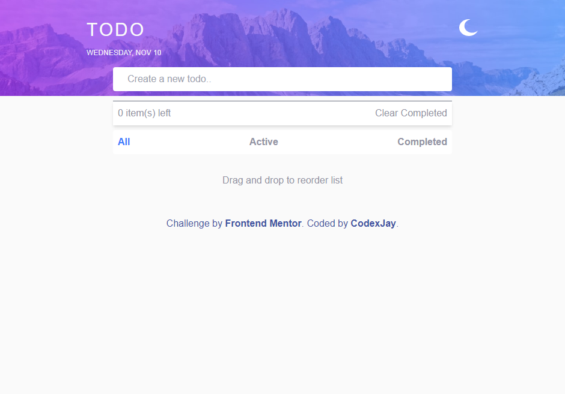

# Frontend Mentor - Todo app solution

This is a solution to the [Todo app challenge on Frontend Mentor](https://www.frontendmentor.io/challenges/todo-app-Su1_KokOW). Frontend Mentor challenges help you improve your coding skills by building realistic projects. 

## Table of contents

- [Overview](#overview)
  - [The challenge](#the-challenge)
  - [Screenshot](#screenshot)
  - [Links](#links)
- [My process](#my-process)
  - [Built with](#built-with)
  - [What I learned](#what-i-learned)
  - [Continued development](#continued-development)
  - [Useful resources](#useful-resources)
- [Author](#author)
- [Acknowledgments](#acknowledgments)


## Overview

### The challenge

Users should be able to:

- View the optimal layout for the app depending on their device's screen size
- See hover states for all interactive elements on the page
- Add new todos to the list
- Mark todos as complete
- Delete todos from the list
- Filter by all/active/complete todos
- Clear all completed todos
- Toggle light and dark mode
- **Bonus**: Drag and drop to reorder items on the list

### Screenshot



### Links

- Solution URL: [Add solution URL here](https://your-solution-url.com)
- Live Site URL: [Add live site URL here](https://your-live-site-url.com)

## My process

### Built with

- Semantic HTML5 markup
- CSS custom properties
- Flexbox
- Mobile-first workflow
- Tailwindcss
- FontAwesome icons
- Vanilla JavaScript

### What I learned

Use this section to recap over some of your major learnings while working through this project. Writing these out and providing code samples of areas you want to highlight is a great way to reinforce your own knowledge.

To see how you can add code snippets, see below:

```html
<body>Some HTML code I'm proud of
  <ul class="todos bg-white dark:bg-input-bg divide-y divide-gray-500 text-listColor dark:text-textColor mt-4 rounded shadow-md select-none"></ul>
</body>
```
```js
function proudOfThisJavascript{
  let index = JSON.parse(localStorage.getItem('CompletedTodos') || '[]');
    for(let i = 0; i < index.length; i++){
      [...listContainer.children][index[i]].children[0].firstElementChild.setAttribute('checked','checked');
      [...listContainer.children][index[i]].children[0].firstElementChild.classList.add('dark:bg-current','border-current');
      [...listContainer.children][index[i]].children[0].firstElementChild.classList.remove('dark:bg-transparent', 'border-gray-300');
      [...listContainer.children][index[i]].classList.add('line-through', 'text-gray-400', 'complete');
      [...listContainer.children][index[i]].classList.remove("active");
    }

    function clearCompletedTodos(){
    let completedTodos = document.querySelectorAll('.complete');
    if(completedTodos.length > 0 && confirm(`You are about to delete ${completedTodos.length} task(s).`)){
      for (let x of completedTodos) {
        x.remove();
        todoCount();
      }
    }else if(completedTodos.length <= 0){
      alert(`There are ${completedTodos.length} completed todos`)
    }
    updateLocalStorage()
  }
}
```

### Continued development

I will continue to develop on my proficiency with tailwindcss, go further into learning react, jquery and other libraries and frameworks.

### Useful resources

- [Sortable JS](https://cdn.jsdelivr.net/npm/sortablejs@latest/Sortable.min.js) - This helped me give the users the ability of reordering their todos. I really liked this resource and will use it going forward when necessary.
- [TailwindCss](https://www.tailwindcss.com) - This is an amazing library which helped me with the styling. It's just amazing. I'd recommend it to anyone.


## Author

- Website - [CodexJay](https://jay035.github.io/PORTFOLIO/)
- Frontend Mentor - [@Jay035](https://www.frontendmentor.io/profile/Jay035)
- Twitter - [@Chibuike035](https://www.twitter.com/Chibuike035)

## Acknowledgments

I just want to use this medium to appreciate [Gabriel Osuobiem](https://github.com/osuobiem) for his help in figuring out how to fix some bugs despite his tight schedule

